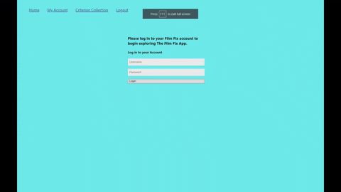
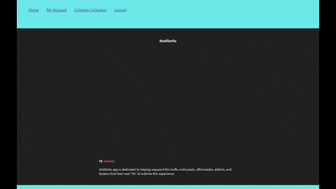
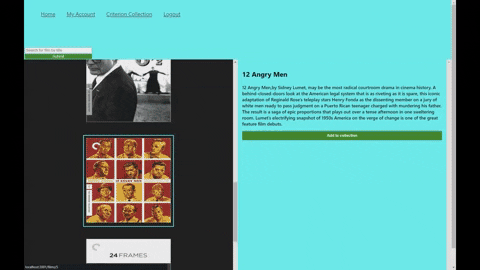
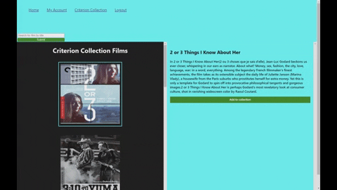
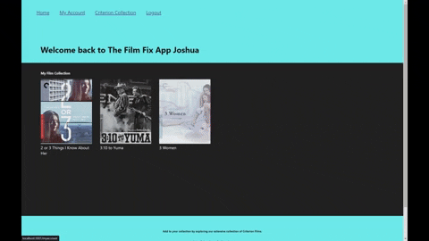
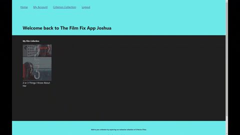

<!-- START doctoc generated TOC please keep comment here to allow auto update -->
<!-- DON'T EDIT THIS SECTION, INSTEAD RE-RUN doctoc TO UPDATE -->

<!-- END doctoc generated TOC please keep comment here to allow auto update -->

<h1 align="center">Welcome to thefilmfix App :film_projector:</h1>

### A simple, yet comprehensive film directory

> Let _thefilmfix_ guide you to your next desperately wanting "fix" of sublime film experience

**Table of Contents** _generated with [DocToc](https://github.com/thlorenz/doctoc)_

- [Project Philosophy](#project-philosophy)
  - [General User Experience](#general-user-experience)
  - [Specific Features](#specific-features)
  - [Installation and Set-up Guide](#installation-and-set-up-guide)
  - [How to Use](#how-to-use)
  - [Resources and Documentation](#resources-and-documentation)
  - [Technologies Used](#technologies-used)
    - [Languages and Frameworks](#languages-and-frameworks)
    - [Package Installations](#package-installations)
  - [Author](#author)

## Project Philosophy

Film is a powerful and transcendent medium that captures, enriches and nourishes our human experience. This project is thus motivated by an irrepresible desire to foster wider audience engagement and communion with films and experiences that provoke, compel, uplift, inspire, subvert, devastate, challenge, and transform our lives.

## General User Experience

_thefilmfix_ app enables users to intuitively browse and search for specific title entries comprising the [Criterion Collection](https://www.criterion.com/) film catalogue. Moreover, users can curate their own private film collections that can be referenced for future viewing purposes.

_thefilmfix_ makes it simple for users to login to an individual account and access all available app features. Following login, users are welcomed to the app with a personalized greeting and may freely navigate to the home page for a general app description and landing page experience. Navigating to the Criterion Collection page, users can select individual films and view additional information, including director, language, and runtime details. **_Logged-in users are also granted the option of adding or removing selected film titles to a private user-curated film collection_**, which effectively serve as wishlists wherein users can log films that seem interesting or warrant future viewing.

> Notably, user-curated collections are only accesible to logged-in users via the user account page.

## Specific Features

- Can view and search for specific film titles from more than one thousand overall entries via [the Criterion Movies Collection dataset](https://www.kaggle.com/datasets/ikarus777/criterion-movies-collection)
- Can select and view individualized profiles for each film, detailing important director, language, runtime, country, and release information
- Can create and access private film collection that allows for easier and faster reference to films of interest and references for future viewing

## Installation and Set-up Guide

> This React app was created via create-react-app

1. To begin, choose a directory and clone project git repository in chosen directory via terminal

   > git clone git@github.com:jmayheww/thefilmfix-app.git

2. Confirm that you are in correct project directory and install all packages

   > npm install

3. Install local json-server

   > npm install -g json-server

4. In this app, JSON-server is already configured to run at local default port 3000 and can be started with the following terminal command

   > npm run server

5. In a separate terminal instance, navigate back to the filmfix-app directory and launch app locally at default port 3001 with the following terminal command

   > npm start

## How to Use

1. **_Input username and password to login to thefilmfix'_**

> 

2. **_Successful login redircts to Home page'_**

> 

3. **_Navigate to My Account to view a personalized welcome message and user film collection'_**

> 

4. **_Visit the Criterion Films page to browse the Criterion Collection in its entirety. Clicking on individual entries displays additional film details_**

> 

5. **_Traverse the film collection by clicking on either the next eight films or previous eight films buttons_**

> 

6. **_Search for specific film titles via the search bar_**

> 

7. **_Add or remove films to private user collection by toggling the add/remove films to collection button_**

> 

8. **_View the user-curated private film collection in My Account and remove films by hovering over individual entries and clicking remove_**

> 

8. **_Navigate to the Logout page to log out of thefilmfix_**

> 

## Resources and Documentation

- [Thinking in React](https://reactjs.org/docs/thinking-in-react.html)
- [Create-React-App documentation](https://create-react-app.dev/)
- [JSON Server documentation](https://www.npmjs.com/package/json-server)
- [Datasets](https://www.kaggle.com/)
- [Criterion Collection](https://www.criterion.com/)

## Technologies Used

### Languages and Frameworks

- HTML
- CSS
- React/JSX

### Package Installations

- Create-React-App
- JSON-server
- React-router

## Author

👤 **Joshua Mayhew**

- : [@jmayheww](https://github.com/jmayheww)
- LinkedIn: [@https:\/\/www.linkedin.com\/in\/joshua-mayhew-28883a89\/](https://linkedin.com/in/https://www.linkedin.com/in/joshua-mayhew-28883a89/)

<!-- # Getting Started with Create React App

This project was bootstrapped with [Create React App](https://github.com/facebook/create-react-app).

## Available Scripts

In the project directory, you can run:

### `npm start`

Runs the app in the development mode.\
Open [http://localhost:3000](http://localhost:3000) to view it in your browser.

The page will reload when you make changes.\
You may also see any lint errors in the console.

### `npm test`

Launches the test runner in the interactive watch mode.\
See the section about [running tests](https://facebook.github.io/create-react-app/docs/running-tests) for more information.

### `npm run build`

Builds the app for production to the `build` folder.\
It correctly bundles React in production mode and optimizes the build for the best performance.

The build is minified and the filenames include the hashes.\
Your app is ready to be deployed!

See the section about [deployment](https://facebook.github.io/create-react-app/docs/deployment) for more information.

### `npm run eject`

**Note: this is a one-way operation. Once you `eject`, you can't go back!**

If you aren't satisfied with the build tool and configuration choices, you can `eject` at any time. This command will remove the single build dependency from your project.

Instead, it will copy all the configuration files and the transitive dependencies (webpack, Babel, ESLint, etc) right into your project so you have full control over them. All of the commands except `eject` will still work, but they will point to the copied scripts so you can tweak them. At this point you're on your own.

You don't have to ever use `eject`. The curated feature set is suitable for small and middle deployments, and you shouldn't feel obligated to use this feature. However we understand that this tool wouldn't be useful if you couldn't customize it when you are ready for it.

## Learn More

You can learn more in the [Create React App documentation](https://facebook.github.io/create-react-app/docs/getting-started).

To learn React, check out the [React documentation](https://reactjs.org/).

### Code Splitting

This section has moved here: [https://facebook.github.io/create-react-app/docs/code-splitting](https://facebook.github.io/create-react-app/docs/code-splitting)

### Analyzing the Bundle Size

This section has moved here: [https://facebook.github.io/create-react-app/docs/analyzing-the-bundle-size](https://facebook.github.io/create-react-app/docs/analyzing-the-bundle-size)

### Making a Progressive Web App

This section has moved here: [https://facebook.github.io/create-react-app/docs/making-a-progressive-web-app](https://facebook.github.io/create-react-app/docs/making-a-progressive-web-app)

### Advanced Configuration

This section has moved here: [https://facebook.github.io/create-react-app/docs/advanced-configuration](https://facebook.github.io/create-react-app/docs/advanced-configuration)

### Deployment

This section has moved here: [https://facebook.github.io/create-react-app/docs/deployment](https://facebook.github.io/create-react-app/docs/deployment)

### `npm run build` fails to minify

This section has moved here: [https://facebook.github.io/create-react-app/docs/troubleshooting#npm-run-build-fails-to-minify](https://facebook.github.io/create-react-app/docs/troubleshooting#npm-run-build-fails-to-minify) -->
